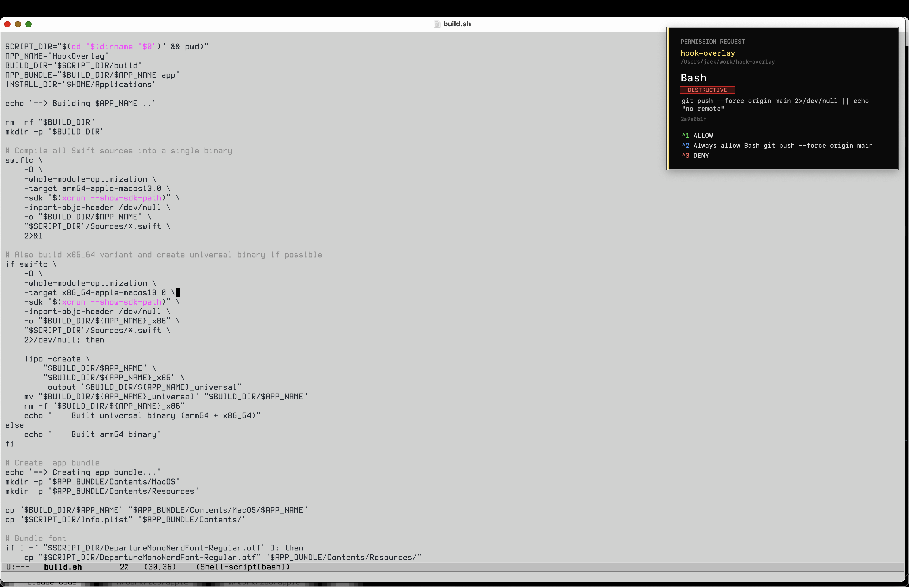

# HookOverlay

A macOS status bar app that intercepts Claude Code permission requests and lets you respond with global hotkeys. No window switching, no clicking.



Built by Claude (Opus 4.6), prompted by jackdoe.

## How it works

Claude Code sessions send permission requests through a Unix socket. HookOverlay queues them and shows a floating panel in the top-right corner. Press the hotkey, keep working.

Each project gets a unique accent color so you never approve the wrong thing.

## Keys

| Key | Action |
|-----|--------|
| ^1 | Allow |
| ^2 | Always allow (when available) |
| ^N | Deny (always last) |

Keys are only captured while requests are pending. Otherwise they pass through normally.

## Setup

```
./build.sh
open ~/Applications/HookOverlay.app
./install.sh
```

## Features

- DepartureMono Nerd Font
- Per-project color coding
- Scrollable full command preview
- DESTRUCTIVE badge on dangerous commands
- Dynamic options matching Claude Code's native prompt
- Carbon hotkeys (no Accessibility permission needed)
- Auto-launches at login via LaunchAgent
- Falls through to native prompt if overlay isn't running

## Uninstall

```
launchctl unload ~/Library/LaunchAgents/com.claude.hook-overlay.plist
rm ~/Library/LaunchAgents/com.claude.hook-overlay.plist
rm -rf ~/Applications/HookOverlay.app
```

Remove the PermissionRequest hook from `~/.claude/settings.json`.
